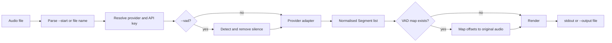

# stt-cli Architecture

## Overview

`stt-cli` is a synchronous Rust CLI that turns one local audio file into a
timestamped transcript. Its distinguishing rule is:

```text
recording start wall-clock time + provider offset = spoken-at wall-clock time
```

The recording start comes from `--start` or the first valid date and time in
the file name. If neither is available, the same pipeline remains useful and
renders relative offsets.

### Release and installation contract

| Area | Current state |
|---|---|
| Version | Canonical `head.yymmdd.patch` in `VERSION`, without a `v` prefix |
| Consumers | Cargo metadata, CLI output, and HTTP user agent share that version; tags add `v` |
| Language/toolchain | Rust 2024 edition, minimum Rust 1.88 |
| Providers | OpenAI, Soniox, Groq |
| Output formats | `text`, `json`, `srt`, `vtt`, `txt`, `csv` |
| Audio optimisation | Optional ffmpeg silence trimming; see VAD constraints below |
| Homebrew | Stable Git checkout pinned to a release tag and commit; optional HEAD build |
| Release assets | Ad-hoc-signed macOS universal binary and SHA256SUMS |
| Checks | Local macOS/Linux and minimum-Rust gates; metadata, release-tooling, unit and updater integration tests |
| License | MIT, declared in LICENSE, Cargo metadata and the formula generator |

While the source repository is private, Homebrew installs and upgrades require
GitHub read access and authenticated Git. Public source access needs no
authentication. Stable source installs build the tagged revision; security
fixes on `main` need a new release and tap update to reach those installations.
The published `v1.260906.0` release predates the current security fixes.

## Components

| Component | Responsibility |
|---|---|
| `src/main.rs` | Clap command tree, top-level orchestration, dry-run reporting, estimated cost, config command handlers |
| `src/config.rs` | Provider identity, environment-variable mapping, provider selection, JSON credential persistence and masking |
| `src/provider.rs` | Provider requests, upload limits, polling, response normalisation, remote Soniox cleanup |
| `src/start_time.rs` | Recorder file-name and `--start` parsing, relative and subtitle timestamp formatting |
| `src/vad.rs` | `ffmpeg` silence detection, speech-only audio generation, compressed-to-original offset mapping |
| `src/transcript.rs` | Shared `Segment` model, Soniox token grouping, six output renderers |
| `src/update.rs` | Homebrew install/upgrade orchestration, verified standalone migration with backup/rollback, read-only GitHub release checks |
| `src/style.rs` | Shared Clap and terminal styles with automatic non-TTY colour removal |
| `VERSION` | Canonical version for the CLI, updater, Cargo metadata and tags |
| `scripts/headatever.sh`, `scripts/version.py` | Version advance, synchronization, validation and annotated tags |
| `scripts/build-release.sh`, `scripts/homebrew.py` | Local universal build and pinned-source formula generation |

`main.rs` is the composition root. The other modules expose small,
provider-independent contracts so timestamp parsing, rendering, VAD mapping,
and credential logic can be tested without invoking a transcription service.

`update` delegates package changes to Homebrew after refreshing its metadata and
ensuring the tap exists. Formula JSON and the active keg distinguish missing,
stable, and HEAD installs. The updater resolves the prefix and Cellar using
`brew`, verifies the resulting binary's version and link ownership, and reports
command failures as errors. Cellar executables are changed only by Homebrew.

For standalone or Cargo installs, `Migration` reserves an adjacent backup
using a hard link. It frees a conflicting Homebrew `bin/stt-cli` path only after
that backup exists and restores it on normal error unwinding. Other standalone
paths are atomically replaced with a symlink to Homebrew's stable `opt` path
only after installation and verification. Successful migrations retain the
original backup. The updater does not modify API-key configuration.
`update --check` remains a separate, read-only GitHub Release lookup using `gh`.
Integration tests run isolated fake `brew` and `gh` processes to cover command
selection, PATH migration, ownership checks, failure recovery, and configuration
preservation.

## Data flow



### 1. Validate and anchor

`main::transcribe` rejects anything that is not a readable file. `anchor_for`
then gives `--start` precedence over the file name. Both inputs use the same
parser, and an absent anchor is carried as `None` instead of inventing a date
or timezone.

### 2. Resolve configuration

An explicit `--provider` wins. Otherwise, the stored
`default_provider` wins; without one, the first provider with a usable key is
selected in OpenAI, Soniox, Groq order. The selected provider's environment
variable takes precedence over its stored key.

`--dry-run` intentionally avoids requiring a key. It resolves the provider and
model for display, falling back to OpenAI when no configuration is usable.

### 3. Optionally compress silence

`vad::detect_speech` uses `ffmpeg silencedetect`. `vad::build_compressed`
adds 200 ms padding around detected speech, concatenates those ranges into a
temporary WAV file, and records how compressed offsets map to the original
audio. Provider timestamps are mapped back before rendering.

Temporary VAD data lives in a randomly named `0700` directory owned by a
`TempDir` guard, with audio created at `0600`. Both VAD-build and provider errors
release the workspace on normal unwinding. Concurrent runs never share or
delete each other's workspaces. Abrupt termination can leave private files.
Canonical input paths and a `file` protocol allowlist prevent option/protocol
confusion and network fetches by ffmpeg/ffprobe. Explicit VAD requests fail when
ffmpeg is unavailable.

### 4. Transcribe through a provider

- OpenAI and Groq use blocking multipart requests to OpenAI-compatible
  transcription endpoints. The client enforces a 25 MB limit and requests
  segment timestamps only when the model name begins with `whisper`.
- Soniox uploads a file, creates an async transcription, polls every two
  seconds for up to 30 minutes, fetches token timings, and attempts to delete
  both the transcription and uploaded file. File cleanup also runs when job
  creation fails; deletion failures produce a warning with the resource ID.
- All adapters return `Vec<Segment>` with offsets in seconds. Soniox tokens
  are grouped at punctuation, speaker changes, or 15 seconds.

HTTP clients require HTTPS and do not follow redirects. JSON responses are
bounded to 64 MiB. Diagnostics redact the current API key, strip control
characters, and omit malformed bodies and deserializer values. Returned Soniox
IDs are validated before use in request paths.

### 5. Render a stable output contract

`transcript::render` is the only format dispatch point. Absolute times are
calculated during rendering, so the provider layer remains unaware of recorder
file names and wall-clock semantics.

- `text` uses absolute wall-clock timestamps or relative offsets.
- `json` preserves offsets and conditionally adds `started_at`, `at`, and
  `speaker`.
- `srt` and `vtt` use media-relative offsets.
- `txt` deliberately drops timestamps and speaker labels.
- `csv` emits offsets, optional absolute time, optional speaker, and escaped
  text; formula-like string cells receive a quoted apostrophe prefix. JSON
  preserves the unmodified strings.

Progress and diagnostics go to stderr; transcript data goes to stdout unless
`--output` is supplied. This keeps shell redirection and pipelines clean.

## Directory structure

```text
.
├── .github/
│   └── dependabot.yml      # weekly Cargo update proposals
├── src/
│   ├── config.rs            # providers and API-key persistence
│   ├── main.rs              # CLI and orchestration
│   ├── provider.rs          # OpenAI, Soniox, Groq adapters
│   ├── start_time.rs        # wall-clock anchor parsing
│   ├── style.rs             # terminal styles
│   ├── transcript.rs        # shared segments and output formats
│   ├── update.rs            # Homebrew updates and standalone migration
│   └── vad.rs               # silence trimming and offset remapping
├── ARCHITECTURE.md          # internals, status, extension guidance
├── Cargo.lock
├── Cargo.toml
├── README.md                # English front door
├── README.ko.md             # Korean front door
├── USAGE.md                 # detailed operator guide
└── VERSION                  # compiled release version
```

## Design decisions

### Keep wall-clock semantics outside providers

Providers know only audio-relative seconds. Anchoring belongs to the application
and rendering layers, which makes providers interchangeable and prevents
timezone or file-name rules from leaking into HTTP code.

### Preserve unknown time as unknown

`NaiveDateTime` represents the local wall-clock value written by the recorder.
No timezone conversion is attempted. When there is no anchor, JSON omits
`started_at` and `at`, and text output uses relative offsets.

### Normalise before rendering

Every provider produces the same `Segment` shape. Adding a provider should not
require changes to timestamp or output logic; adding an output format should
not require changes to provider adapters.

### Prefer a small synchronous runtime

The CLI handles one file per process and uses blocking HTTP. This keeps the
dependency and state model simple. Shell loops provide batch operation. Move to
an async or queued design only when concurrent files, cancellation, or durable
jobs become explicit requirements.

### Keep credentials local and precedence explicit

The JSON config uses atomic replacement with `0600` files in a `0700` directory.
Loading repairs loose permissions and rejects linked/special credential files;
the application config directory cannot be a symlink. Interactive key input
disables terminal echo. The file is not encrypted. Environment variables remain
the automation and one-off override; a future Keychain integration should
preserve the provider-resolution contract.

### Make silence removal transparent

VAD is opt-in. It does not change the public timestamp contract because
compressed offsets are mapped back to the original media. The external
`ffmpeg` dependency and temporary-file lifecycle remain explicit tradeoffs.

### Separate transcript data from progress

Progress uses stderr, while rendered output uses stdout or an explicit file.
New commands and providers should preserve this separation.

## Development workflow

### Local loop

GitHub Actions workflows are not configured. Run these gates locally before
publishing a code change:

```sh
cargo test --locked
cargo clippy --all-targets --locked -- -D warnings
cargo fmt --check
python3 scripts/version.py check
python3 -m unittest discover -s scripts -p 'test_*.py'
bash -n scripts/headatever.sh scripts/build-release.sh
cargo build --release --locked
python3 scripts/version.py check --binary target/release/stt-cli
```

Repeat Rust tests, Clippy and release builds with `cargo +1.88.0` for minimum
toolchain compatibility, and test on both supported operating systems. Run the
[security checks](SECURITY.md#checks) before release publication.

During development, use the narrowest relevant unit test first, then the full
gates. API calls are not needed for parser, renderer, grouping, config, or VAD
mapping changes.

### Change map

| Change | Primary files | Minimum companion work |
|---|---|---|
| Add a provider | `config.rs`, `provider.rs`, `main.rs` | Default model, key/env mapping, selection order, dry-run cost, errors, tests, both READMEs and USAGE |
| Add an output format | `transcript.rs`, Clap `Format` | Renderer tests, command table, example |
| Accept a new timestamp shape | `start_time.rs` | Valid, invalid, optional-seconds, and collision tests |
| Change VAD | `vad.rs`, VAD orchestration in `main.rs` | Mapping/boundary tests, external-tool failure contract, usage docs |
| Change credentials | `config.rs`, config handlers in `main.rs` | Precedence, permissions, masking, migration and security docs |
| Change release behavior | `VERSION`, `update.rs`, `scripts/` | Actual binary version check, source access, Homebrew command/migration failures, backup rollback, installation docs |

### Adding a provider

1. Add the enum case, canonical name, environment variable, and signup URL in
   `config.rs`.
2. Define a provider default model and transport in `provider.rs`.
3. Convert every response into common `Segment` values and clean remote
   resources on success and failure paths.
4. Include the provider in default selection and `config show`.
5. Decide upload limits, timeout behavior, timestamp capability, speaker
   behavior, and dry-run pricing explicitly.
6. Add unit tests for defaults and response transformation, then mocked HTTP
   contract tests before relying on a live account.
7. Update `README.md`, `README.ko.md`, and `USAGE.md` together.

### Adding an output format

1. Add a `Format` enum case and one renderer in `transcript.rs`.
2. Decide whether time is wall-clock, relative, or both.
3. Define speaker behavior, escaping, empty-output behavior, and trailing
   newline behavior.
4. Add exact renderer tests and the format to the command-reference table.

### Release checklist

Release-maintainer scripts require Python 3.11 or newer. Version files are changed
by `scripts/headatever.sh`, never by hand. The script accepts the legacy `v`
prefix on input and writes the canonical unprefixed value.

1. Run the development and security gates above on the complete change.
2. Preview with `scripts/headatever.sh patch --dry-run`, then run
   `scripts/headatever.sh patch`. This synchronizes VERSION, Cargo.toml and
   Cargo.lock in one release commit and creates an annotated `v<version>` tag.
   `--no-git` is available when all checks must run before the commit/tag.
3. Build from the clean, tagged source with `scripts/build-release.sh`. It
   builds both macOS architectures, applies an ad-hoc signature, verifies the
   binary version and architecture, and writes the binary plus SHA256SUMS to
   `target/release-assets`. Recheck version metadata and checksums before upload.
4. Run `scripts/headatever.sh push` to publish the commit and annotated tag.
   Tag pushes do not trigger a build, release, security scan, or tap update.
5. Publish the verified assets and generate the tap formula manually using the
   commands below. A release requires a trusted maintainer's GitHub credentials;
   tap updates require write access to `channprj/homebrew-tap`.
6. Review the formula, run `brew style`, `brew audit`, a fresh installation,
   `brew test channprj/tap/stt-cli`, and check the installed version before
   committing and pushing the tap change.
7. Download the published assets into a separate directory and verify their
   checksums and binary version. Verify `stt-cli update --check` too. Published
   tags and assets are immutable; cut a new patch for later fixes.

After the checks, build and tag push, publish the assets from the local Mac
and generate the formula (replace the tap checkout path):

```sh
release_tag="v$(cat VERSION)"
gh release create "$release_tag" \
  target/release-assets/stt-cli-macos-universal \
  target/release-assets/SHA256SUMS \
  --verify-tag --title "$release_tag" --generate-notes
python3 scripts/homebrew.py --tag "$release_tag" \
  --revision "$(git rev-parse "$release_tag^{commit}")" \
  --output /path/to/homebrew-tap/Formula/stt-cli.rb
```

Do not replace the tag's existing assets. The `headatever.sh release` command
creates release metadata only; it does not build/upload binaries or update the tap.

## Current constraints and recommended next steps

These are evidence-based development priorities, not claims of implemented
work.

1. **Maintain the version and installation contract.** Keep minimum-Rust,
   updater integration, version-tooling and consumer Homebrew checks in the
   release gates. Unit tests alone do not prove a usable packaged release.
2. **Verify manual releases.** Use the local build and formula generator, then
   verify uploaded bytes and the actual Homebrew installation.
3. **Scope batch support explicitly.** The CLI currently accepts one file per
   invocation; shell loops are the supported batch mechanism.
4. **Keep VAD workspaces private.** Preserve the error-path and concurrency
   regression tests. Process termination cannot guarantee destructor cleanup.
5. **Extend provider contract tests with new behavior.** Loopback HTTP tests cover
   Soniox cleanup on success and errors, malformed responses, redirects, and
   response limits. Add billing-free tests for future provider contracts.
6. **Split command modules only when growth justifies it.** `main.rs` currently
   owns CLI definitions, config handlers, dry-run reporting, and orchestration.
   If commands continue to grow, move each command behind a small
   `run(args)` boundary while keeping `main.rs` as the composition root.
