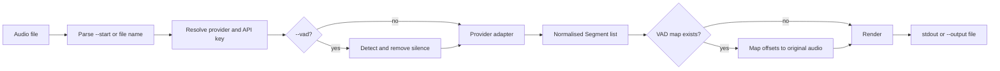

# stt-cli Architecture

## Overview

`stt-cli` is a synchronous Rust CLI that turns one local audio file into a
timestamped transcript. Its distinguishing rule is:

```text
recording start wall-clock time + provider offset = spoken-at wall-clock time
```

The recording start comes from `--start` or the first valid date and time in
the file name. If neither is available, the same pipeline remains useful and
renders relative offsets.

### Status snapshot

This snapshot was derived from `main` on 2026-08-22. Re-check external release
state before relying on it.

| Area | Current state |
|---|---|
| Release version | `VERSION` contains `v1.260818.0` and is compiled into the CLI |
| Language/toolchain | Rust 2024 edition, minimum Rust 1.85 |
| Providers | OpenAI, Soniox, Groq |
| Output formats | `text`, `json`, `srt`, `vtt`, `txt`, `csv` |
| Audio optimisation | Optional `ffmpeg` VAD with original-timeline remapping |
| Distribution | Private repository, Homebrew head install, macOS universal release workflow |
| Automated checks | Unit tests exist in source modules; no pull-request CI workflow is present |
| GitHub Release | No release was returned by `gh release view` at snapshot time |
| License | No repository `LICENSE` file or Cargo license field is present |

The release updater and workflow are implemented, but the end-to-end update
path should be treated as pending verification until a matching
`stt-cli-macos-universal` GitHub Release asset exists and is installed through
that path.

## Components

| Component | Responsibility |
|---|---|
| `src/main.rs` | Clap command tree, top-level orchestration, dry-run reporting, estimated cost, config command handlers |
| `src/config.rs` | Provider identity, environment-variable mapping, provider selection, JSON credential persistence and masking |
| `src/provider.rs` | Provider requests, upload limits, polling, response normalisation, remote Soniox cleanup |
| `src/start_time.rs` | Recorder file-name and `--start` parsing, relative and subtitle timestamp formatting |
| `src/vad.rs` | `ffmpeg` silence detection, speech-only audio generation, compressed-to-original offset mapping |
| `src/transcript.rs` | Shared `Segment` model, Soniox token grouping, six output renderers |
| `src/update.rs` | Latest-release lookup, universal binary download, version check, executable replacement and rollback |
| `src/style.rs` | Shared Clap and terminal styles with automatic non-TTY colour removal |
| `VERSION` | User-facing CLI and updater version source |
| `.github/workflows/release.yml` | Universal macOS build, GitHub Release publication, Homebrew tap formula sync |

`main.rs` is the composition root. The other modules expose small,
provider-independent contracts so timestamp parsing, rendering, VAD mapping,
and credential logic can be tested without invoking a transcription service.

## Data flow



### 1. Validate and anchor

`main::transcribe` rejects anything that is not a readable file. `anchor_for`
then gives `--start` precedence over the file name. Both inputs use the same
parser, and an absent anchor is carried as `None` instead of inventing a date
or timezone.

### 2. Resolve configuration

An explicit `--provider` wins. Otherwise, the stored
`default_provider` wins; without one, the first provider with a usable key is
selected in OpenAI, Soniox, Groq order. The selected provider's environment
variable takes precedence over its stored key.

`--dry-run` intentionally avoids requiring a key. It resolves the provider and
model for display, falling back to OpenAI when no configuration is usable.

### 3. Optionally compress silence

`vad::detect_speech` uses `ffmpeg silencedetect`. `vad::build_compressed`
adds 200 ms padding around detected speech, concatenates those ranges into a
temporary WAV file, and records how compressed offsets map to the original
audio. Provider timestamps are mapped back before rendering.

Temporary VAD data lives under the process-independent
`$TMPDIR/stt-cli-vad` directory and is removed after the normal provider
path. A VAD-build or provider error can leave it behind for a later run to
clean.

### 4. Transcribe through a provider

- OpenAI and Groq use blocking multipart requests to OpenAI-compatible
  transcription endpoints. The client enforces a 25 MB limit and requests
  segment timestamps only when the model name begins with `whisper`.
- Soniox uploads a file, creates an async transcription, polls every two
  seconds for up to 30 minutes, fetches token timings, and attempts to delete
  both the transcription and uploaded file after job creation. A transcription
  creation failure occurs before that cleanup block.
- All adapters return `Vec<Segment>` with offsets in seconds. Soniox tokens
  are grouped at punctuation, speaker changes, or 15 seconds.

### 5. Render a stable output contract

`transcript::render` is the only format dispatch point. Absolute times are
calculated during rendering, so the provider layer remains unaware of recorder
file names and wall-clock semantics.

- `text` uses absolute wall-clock timestamps or relative offsets.
- `json` preserves offsets and conditionally adds `started_at`, `at`, and
  `speaker`.
- `srt` and `vtt` use media-relative offsets.
- `txt` deliberately drops timestamps and speaker labels.
- `csv` emits offsets, optional absolute time, optional speaker, and escaped
  text.

Progress and diagnostics go to stderr; transcript data goes to stdout unless
`--output` is supplied. This keeps shell redirection and pipelines clean.

## Directory structure

```text
.
├── .github/
│   └── workflows/
│       └── release.yml      # tag/manual macOS release and tap sync
├── src/
│   ├── config.rs            # providers and API-key persistence
│   ├── main.rs              # CLI and orchestration
│   ├── provider.rs          # OpenAI, Soniox, Groq adapters
│   ├── start_time.rs        # wall-clock anchor parsing
│   ├── style.rs             # terminal styles
│   ├── transcript.rs        # shared segments and output formats
│   ├── update.rs            # GitHub Release self-update
│   └── vad.rs               # silence trimming and offset remapping
├── ARCHITECTURE.md          # internals, status, extension guidance
├── Cargo.lock
├── Cargo.toml
├── README.md                # English front door
├── README.ko.md             # Korean front door
├── USAGE.md                 # detailed operator guide
└── VERSION                  # compiled release version
```

## Design decisions

### Keep wall-clock semantics outside providers

Providers know only audio-relative seconds. Anchoring belongs to the application
and rendering layers, which makes providers interchangeable and prevents
timezone or file-name rules from leaking into HTTP code.

### Preserve unknown time as unknown

`NaiveDateTime` represents the local wall-clock value written by the recorder.
No timezone conversion is attempted. When there is no anchor, JSON omits
`started_at` and `at`, and text output uses relative offsets.

### Normalise before rendering

Every provider produces the same `Segment` shape. Adding a provider should not
require changes to timestamp or output logic; adding an output format should
not require changes to provider adapters.

### Prefer a small synchronous runtime

The CLI handles one file per process and uses blocking HTTP. This keeps the
dependency and state model simple. Shell loops provide batch operation. Move to
an async or queued design only when concurrent files, cancellation, or durable
jobs become explicit requirements.

### Keep credentials local and precedence explicit

The JSON config is convenient for interactive use and is permission-restricted
on Unix, but it is not encrypted. Environment variables are the automation and
one-off override. A future Keychain integration should preserve the same
provider-resolution contract.

### Make silence removal transparent

VAD is opt-in. It does not change the public timestamp contract because
compressed offsets are mapped back to the original media. The external
`ffmpeg` dependency and temporary-file lifecycle remain explicit tradeoffs.

### Separate transcript data from progress

Progress uses stderr, while rendered output uses stdout or an explicit file.
New commands and providers should preserve this separation.

## Development workflow

### Local loop

The repository currently has no pull-request CI, so run all three gates before
publishing a code change:

```sh
cargo test
cargo clippy --all-targets -- -D warnings
cargo fmt --check
```

During development, use the narrowest relevant unit test first, then the full
gates. API calls are not needed for parser, renderer, grouping, config, or VAD
mapping changes.

### Change map

| Change | Primary files | Minimum companion work |
|---|---|---|
| Add a provider | `config.rs`, `provider.rs`, `main.rs` | Default model, key/env mapping, selection order, dry-run cost, errors, tests, both READMEs and USAGE |
| Add an output format | `transcript.rs`, Clap `Format` | Renderer tests, command table, example |
| Accept a new timestamp shape | `start_time.rs` | Valid, invalid, optional-seconds, and collision tests |
| Change VAD | `vad.rs`, VAD orchestration in `main.rs` | Mapping/boundary tests, external-tool failure contract, usage docs |
| Change credentials | `config.rs`, config handlers in `main.rs` | Precedence, permissions, masking, migration and security docs |
| Change release behavior | `VERSION`, `update.rs`, release workflow | Actual binary version check, asset name, private-repository auth, rollback test, installation docs |

### Adding a provider

1. Add the enum case, canonical name, environment variable, and signup URL in
   `config.rs`.
2. Define a provider default model and transport in `provider.rs`.
3. Convert every response into common `Segment` values and clean remote
   resources on success and failure paths.
4. Include the provider in default selection and `config show`.
5. Decide upload limits, timeout behavior, timestamp capability, speaker
   behavior, and dry-run pricing explicitly.
6. Add unit tests for defaults and response transformation, then mocked HTTP
   contract tests before relying on a live account.
7. Update `README.md`, `README.ko.md`, and `USAGE.md` together.

### Adding an output format

1. Add a `Format` enum case and one renderer in `transcript.rs`.
2. Decide whether time is wall-clock, relative, or both.
3. Define speaker behavior, escaping, empty-output behavior, and trailing
   newline behavior.
4. Add exact renderer tests and the format to the command-reference table.

### Release checklist

1. Reconcile the version representation in `VERSION`, Cargo metadata, Clap
   output, updater comparison, tags, and the workflow.
2. Run the full Rust gates.
3. Push a matching tag or dispatch the release workflow with an explicit tag.
4. Verify the universal binary architecture and actual `stt-cli --version`
   output.
5. Verify the GitHub Release asset, Homebrew formula update, private download
   authentication, and `stt-cli update --check`.
6. Install through each supported path and run a non-secret smoke check such as
   `stt-cli config path`.

## Current constraints and recommended next steps

These are evidence-based development priorities, not claims of implemented
work.

1. **Add pull-request CI.** Run `cargo fmt --check`,
   `cargo clippy --all-targets -- -D warnings`, and `cargo test` independently
   of the release workflow.
2. **Unify the version contract.** `VERSION` contains a leading `v`, Cargo
   still declares `0.1.0`, the HTTP user agent uses the Cargo version, and the
   release workflow derives and compares tag/version strings separately.
   Choose one canonical raw version representation and derive every other
   surface from it.
3. **Prove release and self-update end to end.** The workflow and updater exist,
   but there was no GitHub Release at snapshot time. Test the exact asset,
   authenticated private download, version check, executable replacement,
   rollback, and Homebrew tap update.
4. **Choose one VAD failure contract.** The `vad.rs` module comment describes
   graceful fallback when `ffmpeg` is missing, while the real transcription
   path currently propagates an error. Either implement the fallback or make
   explicit failure the documented and tested contract. Also use a
   process-specific temporary directory and guarantee cleanup on every exit.
5. **Add provider contract tests.** Current tests cover helpers, defaults,
   grouping, and rendering but not multipart payloads, polling transitions,
   timeouts, malformed responses, or cleanup against a mocked HTTP server.
6. **Declare the license consistently.** The generated Homebrew formula says
   MIT, while the repository has no `LICENSE` file and Cargo has no
   `license` field. Resolve that before broader distribution.
7. **Split command modules only when growth justifies it.** `main.rs` currently
   owns CLI definitions, config handlers, dry-run reporting, and orchestration.
   If commands continue to grow, move each command behind a small
   `run(args)` boundary while keeping `main.rs` as the composition root.
